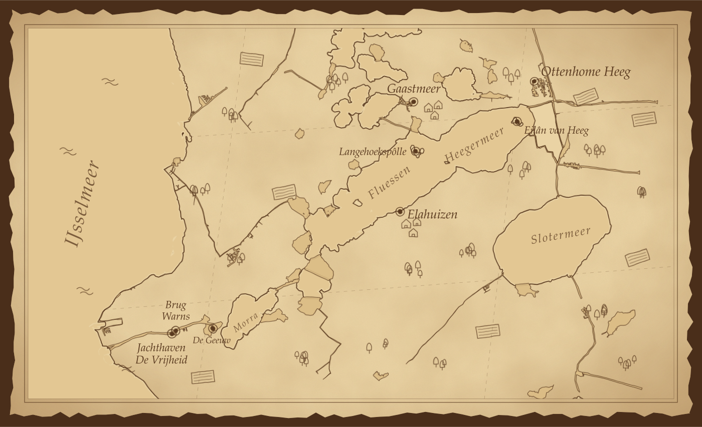

# Friesland göllerinde bir yelken turu

Ottenhome Heeg'den kiraladığımız Jeanneau Sun Odyssey 319 model tekneyi teslim almak için saat 11:15'te şirket limanına ulaştık. Danışmadaki görevli bize teknemizin bağlı olduğu iskele bilgisini verip bir yetkilinin bizi karşılayacağını söyledi. Biz de çantalarımızı sırtlayıp teknemize doğru yürümeye başladık. Tekneyi bulmak zor olmadı. Tek sorun, yan yana duran iki SO 319'dan hangisinin bizimki olduğunu bilmememizdi. Neyse, biz teknelere bakarken görevli gelip bizim teknemizin adının "Explorer Six" olduğunu söyledi. Detaylı bir tanıtıma ihtiyacımız var mı diye sordu ama halihazırda kendi çabamla yeterince bilgi edindiğim için birlikte sadece motoru bir kez çalıştırsak yeterli olur dedim. Birlikte motoru çalıştırıp durdurduk ve görevli bizimle vedalaşıp gitti. Artık teknemiz ile baş başaydık. İlk iş, çantaları içeri atıp tekneyle tanışmak oldu. Kabinlerin durumu, tuvalet ve mutfak. Sonrasında seyir dokümanları ve cihazlar. Kontrol paneli testi, temiz su, kirli su, servis ve motor akü seviyeleri ve yakıt seviyesi. Hepsi tamam. Sonrasında güvertede yelken donanımı ve halat kontrolü. Birkaç fotoğraf çekimi ve tekne kontrolü tamamdır.

Hızlıca eşyaları yerleştirip tekneyi seyre hazır hale getirdik. İlk aşamada teknenin dinamiklerine alışmak adına ileri manevra ile içinde bulunduğumuz box'tan[^box] 5 metre kadar ayrılıp tekrar kıçtan bağlandık. Rüzgar çok hafif olduğu için herhangi bir zorluk yaşamadık. Bu arada daha önce hiç kullanmadığım bow thruster'ı da deneme ve hayatı ne kadar kolaylaştırdığını görme fırsatım oldu.

İkinci aşamada box'tan ve limandan tamamen ayrılıp kanal içerisinde yaklaşık 100 metre seyir yapıp tekrar box'a dönüp bağlanmayı denedik. Liman ağzının dar olması ve sancak tarafında başka teknelerin bağlı olması çıkışta hafif stres yaratsa da bow thruster'ın verdiği güvenle bu manevrayı da sorunsuz tamamladık. Dikkatimizi çeken şey dümenin çok hassas oluşuydu. Muhtemelen ayarlanıyordur ama biz bulamadık.

Artık limandan ayrılmaya hazırdık. Motor seyri ile Heegermeer gölüne çıktık. Haritadan da beklediğimiz gibi göl boyunca şamandıralar ile tekne trafiği (vaargeul)[^vaargeul] için işaretlenmişti. Bu seyri çok kolaylaştırıyor tabii ki; hem de yelkeni nerede açabileceğimiz konusunda fikir veriyor. Tek sorun şuydu: seyir yolu bile 2,5 metre derinlikteyken, dışarısı kim bilir ne kadar sığdı. Eilan van Heeg isimli adayı geçtikten sonra seyir yolunun kuzey tarafından dışına çıkıp yelkenlerimizi açtık. Tabii rüzgar güney batı yönünden estiği için tramola ata ata yolumuza devam ettik. Parçalı bulutlu, 2-3 beaufort sertlikte rüzgar ile gayet keyifli bir seyir bizi bekliyordu. Tek sıkıntı zaman zaman 90 cm'e inen sığ sulardı. 75 cm kadar çok kısa bir salması olan teknemizi bile karaya saplanma riski ile baş başa bırakıyordu. Hedefimiz girip öğle yemeği yiyebileceğimiz bir liman bulmaktı. Haritada en uygun görünen yer Elahuizen isimli kasabaydı ama kasabadaki marinalara dair en ufak bir fikrimiz yoktu. Amacım da aslında hakkında hiçbir fikrim olmayan bir marinaya habersiz girmeyi tecrübe etmekti.

Marrekrite[^marrekrite] Langehoekspol adasına geldikten sonra sığ suyun ve manevra alanının daralması ile motor seyrine dönüp seyir yoluna girdik. Yaklaşık saat 3'te Elahuizen'e ulaştık ama işler umduğumuz gibi gitmedi. Kasaba içerisinde bulunan ufak marinaların hepsinin girişinde açıkça "özel iskele; izinsiz giriş ve kısa süreli bağlanma yasaktır" yazıyordu. Hayal kırıklığı ile yol üzerinde gördüğümüz Marrekrite Langehoekspol adasına dönüp oraya bağlandık. Bağlanma manevrasını klasik geri giderek değil ileri yönde yaptım. Sancak tarafından yaklaşarak sancak kıç halatını hedeflediğimiz koç boynuzuna atmaya çalıştım ama hızımı ve mesafemi ayarlayamayıp 2 sonraki koç boynuzuna bağlandık. Önümüz boş olduğu için herhangi bir sıkıntı olmadı. Ufak bir adanın merkezinde yapılmış halka açık bağlanma yerleri, bir etkinlik için gelmiş klasik ahşap Hollanda yelkenlileri ve biz. Bir süre sonra 50'li yaşlarında bir kadın kaptan, klasik ahşap teknesini (https://www.vrouwejitske.nl) tek başına ve gürültülü bir şekilde yanımıza bağlayarak bizi hayretler içinde bıraktı. Yanımızda getirdiğimiz sandviçleri yedikten sonra gecelemek için bir yer bulmak adına Gaastmeer kasabasına doğru yola çıktık. İskeleye, teknenin iskele tarafından bağlanmıştık. Ayrılma manevrası için sancak spring'i kullanmak istedim ama pek hayal ettiğim gibi olmadı.

Motor seyri ile Gaastmeer kasabasındaki Pieter Bouwer marinasına ulaştık. Neyse ki bu marina bir kayıt iskelesine sahipti ve yaklaşık 4:30 gibi iskeleye bağlandık. İnip marina görevlisinin yanına gittik. Şansımıza son anda onu yakaladık. Görevli, doğrusu marinada birinin gecelemek istemesine şaşırdı. Çünkü çok küçük bir kasabaydı ve kasabanın tek restoranı da 1 saat içinde kapanacaktı. Bizim sadece gecelemeye ihtiyacımız olduğunu söyledik. Herhangi bir müsait box olmadığı için bize beton duvara bağlanıp geceleyebileceğimizi söyledi; 20 Euro ödeyerek yanından ayrıldık ve gösterdiği yere bağlandık. Kısa bir kasaba turu yaptıktan sonra gelip aşırı sessiz ve sakin konaklama yerinde uyku moduna geçtik. Tamamen duran hava ile gelen birkaç sivri sinek dışında her şey mükemmeldi.

Sabah 9:15 gibi iskeleden ayrıldık. İskele tarafından duvara bağlı olduğumuz için spring line kullanarak geri manevra ile başımızı açıp sonra ileri manevra yaptık. Gayet temiz bir çıkış oldu ama çıkıştan hemen sonra, baş tarafımızdan 15 metre ileride bulunan iki direğe iskele tarafımızdan fazlaca yaklaştık. Sanırım salmamız çok kısa olduğu için tekne yanal olarak çok kayıyordu. Usturmaçalar sayesinde sorun yaşamadan marinadan ayrıldık ve tekrar Fluessen gölüne çıktık. Amacımız gölün sonundaki Brug Warns köprüsünden geçmekti. Önce yelken seyri denedik ama yine karşıdan gelen rüzgar pek izin vermedi. Dar alanda kendimizi riske atmamak adına biz de diğer tekneler gibi motor seyri ile seyir yoluna girdik. Yaklaşık 12 sularında köprüye ulaştık. Köprüye ulaşmadan önce ne harita ne de internet üzerinden köprünün açılış kapanış saatleri ile ilgili bilgi bulamadık. Bunu bilmemek seyir için risk yaratıyor çünkü herhangi bir rüzgar ve uzun süreli bekleme durumunda güvenli bir yere bağlanmam gerekir ve köprüye yakın böyle bir yer var mı bilmiyordum. Neyse ki her iki geçişimizde de köprüye yaklaştığımız zaman köprü açıldı. Sanırım tekne trafiğine bağlı olarak açılan bir köprü. Bunun araştırmasını yapacağım.

Köprüden geçtikten sonra kendimizi bir öğle yemeği molası için hemen yakındaki görece büyük Jachthaven De Vrijheid marinasına attık. Yine herhangi bir haber vermeksizin teknemizi ilk gördüğümüz boş box'a bağladık. Yemek öncesi kısa bir marina yürüyüşü yapıp geri geldiğimizde, tedirgin bir şekilde bizi bekleyen bir tekne sahibi ile karşılaştık. Maalesef onun yerine bağlanmıştık ve o da bir hayli gerilmişti. Neyse, hemen ayrılacağımızı söyleyince rahatladı. Biz de öğle yemeğini sonraya bırakıp hızlıca marinadan ayrıldık.

Artık saat 1 olmuştu ve teknemizi geri vermek üzere Ottenhome limanına dönme vakti gelmişti. Dönüş yolunda tatlı bir pupa seyri bizi beklediği için motor seyri ile De Geeuw gölüne kadar geldik ve gölde bulduğumuz boşlukta hızlıca ana yelkenimizi açtık. Fakat iskotayı boşlamayı unutmuştuk. Yelken neredeyse tamamen açılmıştı ki hafif motor ile rüzgar yönüne tuttuğum tekne bir anda sert bir rüzgar yakaladı. Önce apaz seyrine döndü, sonrasında gelen sağnakla birlikte bizi sertçe yatırdı. Neyse ki ön yelken açık değildi ve tekne kendiliğinden tekrar rüzgar yönüne döndü, rüzgarın etkisini yitirdi. Motora tam güç verip yelkenimizi tamamen açtık ve oradan ayrıldık. Daracık gölde bunca mücadelenin sonunda sığlığa girmiştik; salmanın çamura sürttüğünü hissediyordum. Neyse ki saplanmadan seyir yoluna çıktık.

Beklediğimiz gibi yaklaşık 3 beaufort rüzgar ile 5 knot pupa seyri ile diğer teknelerin trafiğine karıştık. Tabii bu sakin seyir bizi ayı bacağı denemeye itti ama ön yelken pek söz dinlemiyordu. Üzerine de beklenmedik bir gijp stresi tabii. Baktık ki diğer yelkenliler sadece ön yelken ile seyir yapıyor, biz de ana yelkeni kapatıp ön yelkenle yolumuza devam ettik. Hızımız hâlâ 4,5 knot civarındaydı; hem ön yelken uslu duruyordu hem de ana yelkenin gijp stresi ortadan kalkmıştı. Bu sakin seyirden istifade ederek biz de meyveli yoğurtlarımızı yedik. Tekneyi teslim öncesi son bir dinlenme ve kahve molası için yolumuzun üstündeki Marrekrite Langehoekspol adasına ikinci kez bağlandık. Vrouwe Jitske ve komşuları hâlâ oradaydı.

Artık saat 3 olmuştu ve yola çıkma zamanı gelmişti. Yine ön yelken ile Eilan van Heeg'e kadar seyrimizi sürdürüp orada motor seyrine geçtik. Sadece ön yelken ile seyir yapmanın bir diğer güzelliği, yelkenleri kapatmak için rüzgara doğru dönmek gerekmemesi. Seyir anında rotanızı değiştirmeden hızlıca yelken açıp kapatabiliyorsunuz. En nihayetinde motor seyri ile Ottenhome limanına geldik. Dar geçişten geçtik ve box'a yanaşmak için geri manevra yaptık. O ana kadar her şey yolunda gitmesine ve gireceğimiz box hemen arkamızda olmasına rağmen teknemiz iskele tarafına yavaş yavaş sürüklenmeye devam etti ve iskele tarafındaki direklere yaslandı. Direkler esnek ve plastik olduğu için herhangi bir zarar vermese de gereksiz bir gerginlik yarattı. Pervane yan etkisi ile ilgisi olmayan bu durum sanırım salma kısalığı ve su akıntısı ile ilgili. Tabii hafif bir rüzgar da vardı ama iskele kıç omuzluktan geliyordu. Sonunda temiz bir manevra ile box'a girip bağlandık. Eşyalarımızı topladık ve bu macerayı sonlandırıp teknemizi kusursuz şekilde teslim ettik. Hâlâ temiz su tankımız doluydu, pis su tankımız boştu. Sanırım yakıtın da yüzde 5'ini kullanmıştık.

---

---

[^box]: Kıçtan iskeleye bağlanılan, baş tarafında direkler bulunan bağlama alanı.
[^vaargeul]: Hollandaca "seyir kanalı". Şamandıralarla işaretlenmiş, derinliği garanti edilen tekne trafiği güzergâhı.
[^marrekrite]: Recreatieschap De Marrekrite; Friesland'ın göl ve su yollarındaki doğa alanlarında halka açık bağlama yerleri yapan ve bakımını üstlenen kamu kuruluşu. Bu bağlama yerleri de aynı isimle anılır.
